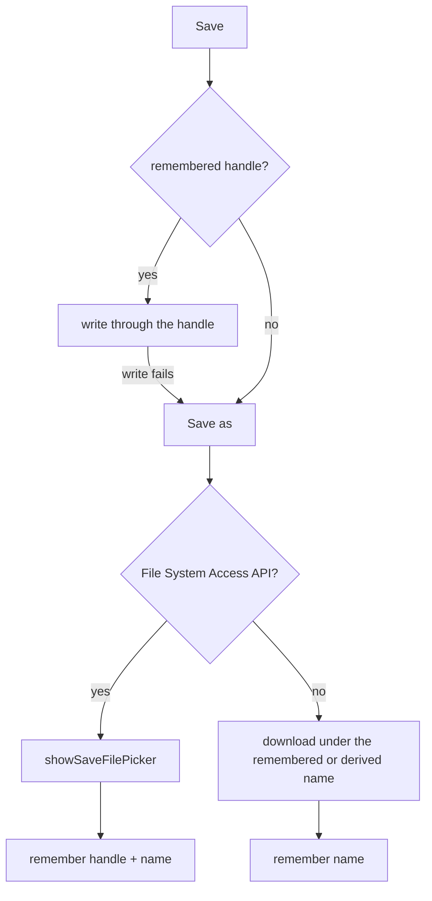

# 019: Save writes back to a remembered file

**Status**: accepted · **Date**: 2026-08-12

## Context

Save used to download the document under a fixed name, so every press made a new file and a board named nothing. The reader's expectation (issue 47) is the desktop one: choose a file once, have plain save overwrite it, have save-as move to a new one, and see which file is open in the tab.

A browser page cannot write to disk by path. The File System Access API grants a `FileSystemFileHandle` through a picker, and that handle can write in place for the rest of the session. Chromium ships the API; Firefox and Safari only offer downloads and file inputs.

## Decision

The board remembers one file per session: a handle plus its name, in a module store beside motion and keybindings (`packages/app/src/files/fileContext.ts`).

**The remembered file is session state.** Where the document sits on this machine says nothing about the domain, and a handle cannot be serialized into a trace, so it stays out of the command bus (decision 001). The tab title and the toolbar read the store; `modl - payments` is derived from the file name, and the board title inside the document stays a separate concept.

**Save writes through the handle; save-as asks.** A plain save with no remembered file behaves as save-as, and a remembered handle that fails to write (the file moved, or its permission lapsed) recovers by asking again. Save-as always opens the picker, suggests the remembered name or one derived from the board title, and remembers the answer. Load prefers `showOpenFilePicker` for the same reason: the opened file becomes the save target. A file that fails to parse leaves both the board and the remembered file alone, so the next save cannot overwrite it with a different document.

**Browsers without the API fall back.** Save downloads under the remembered name and load opens the hidden file input. The name is still remembered, so the tab, the toolbar, and the suggested name hold; the browser stores each save as a fresh download, which is the ceiling of what those browsers allow.

**The file is forgotten on reload.** The document itself lives only in the session, so restoring the handle alone would put a file's name over an empty board. Remembering the file across reloads belongs with document persistence, whenever that arrives.

## Consequences

Playwright cannot drive the native pickers, so the e2e suite stubs both on every page (`e2e/support.ts`), and save assertions read what the fake handles wrote. One test deletes the stubs to drive the download fallback.

The full path never shows anywhere: the API withholds it from the page, so hovering the toolbar name gives the file name and nothing longer.

Undo can cross a load while the remembered file stays put, so a save after undoing a load writes the pre-load board into the loaded file. The reader asked for exactly that file to be written; a warning here would need the file context to observe the command log, and nothing yet justifies that coupling.

## Rejected

**Persisting the handle in IndexedDB.** The handle survives there and nothing else does; on the next visit the page would need a user gesture to re-request permission, for a document it no longer holds.

**Routing the file context through the command bus.** A trace replayed on another machine cannot reproduce a handle, and decision 001 keeps state that a reader would never save out of the log.

**Keeping download-only saving with a name prompt.** A prompt fixes the fixed name and still cannot overwrite, so every save keeps minting `name (1)` files, which is the complaint itself.

## What would reverse this

Document persistence across reloads would move the remembered file into whatever store the document gets. The File System Access API reaching Firefox and Safari would delete the fallback paths.
