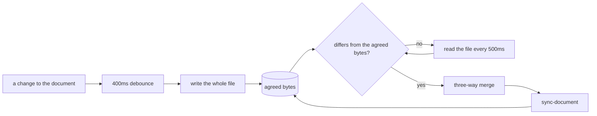

# 032: Sync mode writes the board to its file, and merges the file back in

**Status**: accepted (proof of concept) · **Date**: 2026-08-17

## Context

Issue #97: while an agent edits a document, the board goes stale. Someone working with an agent saves by hand, waits for the agent's write, then presses Load and gets a fresh scene: the camera reframes, the filter clears, the selection goes, and every group closes back to the document's hint. The work of looking at the board is thrown away on every round trip.

The issue asks for a mode where the board writes itself to the file and takes the file's changes as they arrive, and it names the property that makes it usable: the layout should hold still, so the whole view does not snap when an agent writes, unless the two sides disagree about a position, where the file decides. It also asks for a proof of concept rather than a finished feature, because how this should feel is not yet settled.

## Decision

**Sync mode is a session mode over the remembered file, off until asked for.** It follows the file that decision 019 already remembers, so it needs no file concept of its own, and it holds no state a trace could replay: a handle cannot be serialized, and where a document sits on this machine says nothing about the domain. The toggle sits beside Save and Load, disabled until the board has a file to write to. Turning it on writes the board to the file straight away: the reader is looking at the board, so those are the bytes both sides start from.

**The agreed bytes keep each loop from reacting to the other.** `agreed` holds the exact text the board and the file last shared. A poll that reads those bytes back has nothing to do, so the board never reacts to its own write, and an agent's write is visible as the first read that differs. No modification times, no file locks, no write flags to get out of step: one string comparison.

**The merge is three-way, keyed by id, and the file decides a genuine disagreement.** `reconcileDocuments` takes the agreed file content as the base, the board as one side, the file as the other, and applies one rule to every map in the document (elements, notes, comments, layout) and to the title: whichever side moved away from the base is taken, and where both moved, the file's version stands. Absence is a value, so an element the board added while the file was not looking survives, and one the board deleted stays deleted. This is what keeps the board still: an agent that renames one element changes one key, and every box, group, and line the reader arranged is untouched, because neither side moved it.

**Silence is not an instruction.** The loader fills a missing position with a grid slot and a missing map with an empty one (`withDefaultLayout`), which a naive merge reads as "every box moved to the grid, and every comment deleted". A producer emitting structure alone is the documented way to generate a document (docs/agents.md), so that reading would make sync unusable with exactly the agents it is for. `fileStatement` reads the file's own JSON for what it mentions: layout keys it states, whether it carries a comments or notes map, whether its view carries a first-open hint. What the file leaves out, the board keeps.

**The camera never arrives from the file.** Pan and zoom live in the document, and an explicit Load still frames what the file says, but a sync keeps the reader's camera whatever the file holds. A pan or a zoom also never triggers a write: the write loop compares documents with the camera flattened, so looking somewhere else does not churn the file under an agent watching it, and the camera still travels out with the next real change.

**A sync is its own command, and it keeps the session.** `sync-document` carries the merged document and swaps it into state, keeping the filter, the selection, the expanded groups, the hidden set, and focus mode, pruned to what the file still holds. It emits `document-synced` plus the per-item events the change contains, so the canvas holds the camera where a load reframes it, and the elements an agent added warp in the way hand-drawn ones do. The command carries the merged result rather than the file's own bytes, so a replayed trace reaches the same board without the file being there.

**The file is read on a timer, and a half-written file is a wait rather than an error.** The File System Access API has no change notification, so a poll reads the file twice a second. Another program's write is not atomic, so a read can land on half a document: the board keeps what it has, the status says the file does not read as a document yet, and the next read recovers with no press in between.

## Consequences

Sync only runs where the File System Access API does, which today is Chromium. The toggle stays disabled in Firefox and Safari, where a save is a download and there is no handle to write through or read back.

The file is read whole twice a second while the mode is on. At board size (tens of kilobytes) that is cheaper than tracking modification times correctly, and it makes the loop immune to a filesystem whose timestamps are coarse. A large document would want `FileSystemObserver` instead, which is the same loop with the poll deleted.

Undo crosses a sync. `sync-document` is an ordinary undoable command, so Ctrl+Z after an agent's write refolds the log to before it and the write loop then sends that older board back to the file, overwriting the agent. Nothing about a PoC settles what undo should mean when two writers share a document, and it is the first thing to test by playing with the mode.

A local edit made and then contradicted by the file inside the same 400ms window is lost, because the file decides and the board's edit had not reached the base. The window is small and the alternative is holding a reader's edit above an agent's, which the issue rules out.

New elements from the file land where the loader puts them: a grid slot near the origin, which can overlap what the reader arranged. The CLI's `layout` and `reflow` commands are the intended answer for a producer, and whether the board should place incoming elements itself is an open question this PoC exists to answer.

## Rejected

**Reusing `load-document` for an inbound change.** A load is a scene change: it clears the filter and the selection, reseeds expansion from the document's hint, and the canvas frames the board. That is right when a reader asks for a file and wrong when a file arrives, and it is the exact flash the issue asks to remove.

**Letting the file replace the board outright.** Simple, and it undoes the reader's arrangement every time an agent writes a structure-only document. The three-way merge exists so the file decides a disagreement and its silence decides nothing.

**Merging inside the reducer.** `sync-document` could carry the file's own document and merge against state as it applies. Then a trace would replay a merge against whatever board the replay happened to hold, and the same log would land on different boards. Resolving the merge before the dispatch keeps the command log a record of what happened.

**Persisting the mode across reloads.** The handle does not survive a reload (decision 019), so the mode would come back on with nothing to follow. Sync goes wherever remembering the file goes.

## What would reverse this

`FileSystemObserver` reaching a stable Chromium deletes the poll and its read cost. The File System Access API reaching Firefox and Safari makes the mode general rather than Chromium-only. Playing with the PoC settling what undo should mean across a sync, or where incoming elements should be placed, would change the rules above rather than the structure under them.
