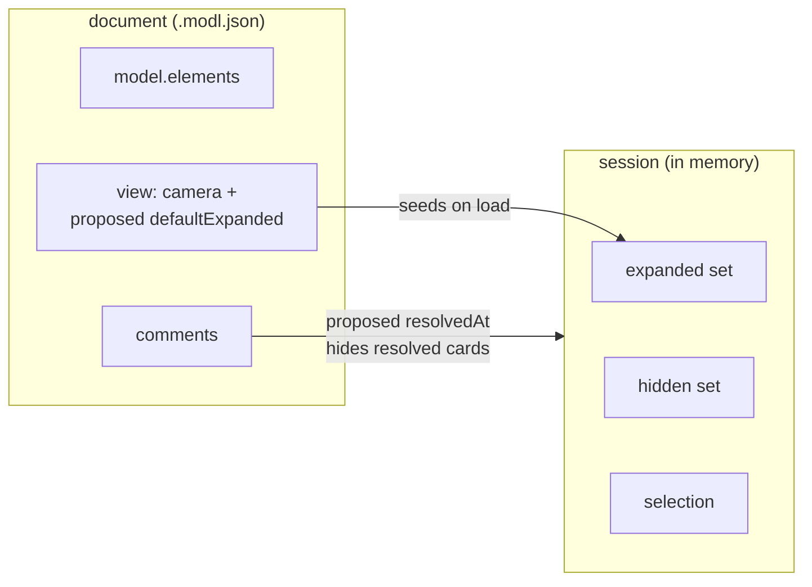

# Proposal: what the document carries for first-open expansion, regions, and review state

**Status**: proposed · **Date**: 2026-08-12 · **Decides**: issues [#50](https://github.com/xpcoffee/modl/issues/50), [#53](https://github.com/xpcoffee/modl/issues/53), [#57](https://github.com/xpcoffee/modl/issues/57)

Three issues each ask the document format to carry something new. Deciding them together keeps one principle intact, so a later addition has a rule to follow instead of a precedent to fight.

The principle, already implicit in decisions [001](../decisions/001-command-bus.md), [009](../decisions/009-viewing-tools.md), and [016](../decisions/016-comments.md):

- the **document** carries what the author means: structure, discussion, and presentation defaults;
- the **session** carries what the reader is doing: expansion, hiding, selection, camera movement;
- the **trace** carries what happened: every command, replayable.



Each question below gives the options, the tradeoff that decides it, and a recommendation. Disagree per section; the sections are independent except for the shared version bump at the end.

## Question 1 (#50): who decides how a document first opens?

A dense document opens as a handful of collapsed boxes, and a reader building context expands every group by hand on every load. The review that raised this asked to "keep the board expanded by default" for one specific document, which is authorial intent about first presentation.

Expansion stays session state while reading: two people reading the same file must not fight over what is open (docs/domain-model.md). The question is only who seeds the first state.

| Option | Scope | Format change | The catch |
|---|---|---|---|
| A. App preference: open every document fully expanded | reader | none | Blunt. The ask was about one document; a global toggle changes all of them, and a small board gains nothing from it |
| B. Document hint: `view.defaultExpanded` | author | yes | The author's taste binds every reader's first open; readers can still collapse immediately |
| C. Persist the expanded set per document in browser storage | reader + document | none | Helps only the returning reader on the same machine; the first open, which the review complained about, stays collapsed |

**Recommendation: B.** `view` already carries a presentation default (the camera), and "open expanded" is the same kind of statement. Shape:

```jsonc
"view": {
  "pan": { "x": 0, "y": 0 },
  "zoom": 1,
  "defaultExpanded": true      // or an array of group ids to open exactly those
}
```

Missing means collapsed, today's behaviour. The hint seeds the expanded set on load; every later expand and collapse is the reader's session, exactly as now. C composes with B later (the stored set, when present, beats the hint for that reader) and can ship separately if returning-reader friction shows up. A is rejected for scope: it answers a per-document request with an every-document switch.

## Question 2 (#53): where does a regional comment point?

A comment with empty `targets` means "the whole document", but three of eleven review comments in the source session were regional ("the member journey should also capture...") and the reader had to infer the region from the text.

| Option | Format change | The catch |
|---|---|---|
| A. A region is its targets: point at the group, or at the elements concerned | none | Some regions have no group; the authoring flow must make targeting easy, or authors keep writing untargeted remarks |
| B. Comment carries a captured rect `{x, y, width, height}` | yes | Geometry rots: one reflow moves every box and the rect points at empty space. It also couples discussion to layout, which decision 016 deliberately separates |
| C. Auto-pin the comment card at the viewport position at creation | none (pins exist in `layout`) | Same rot as B, just via the existing pin mechanism; a pin says where the card sits, and readers would now have to treat it as meaning |

**Recommendation: A, through an authoring affordance; the format stays as it is.** Targets already accept any element, groups included, so the format can express a region today; the review comments arrived regional yet untargeted because nothing helped the author pick targets. The affordance: when a comment is created with nothing selected, and the viewport sits over a group, the editor offers that group as the target, and the author confirms or clears it. Rules guide, the author decides, matching the paradigm-preselection behaviour in docs/domain-model.md.

B stays available as the escalation if real documents keep producing regions that no group and no selection can name. Evidence for that would be authors repeatedly declining the offered target and describing geometry in prose.

## Question 3 (#57): what happens to a resolved comment?

Comments have no resolution state, so applying a review mutates the reviewer's words: one round replaced comments with "resolved" notes, the next preferred delete-on-resolve with the story told outside the model.

| Option | Format change | The catch |
|---|---|---|
| A. `resolvedAt` timestamp on the comment; the board hides resolved comments by default | yes | The file accumulates closed discussion until someone prunes it |
| B. Delete on resolve; the trace and git history are the audit trail | none | The trace is session-scoped and rarely leaves the machine; the audit story degrades to reading git diffs of the file |
| C. Full review mechanic: replies (`parentId`) plus status | yes, large | Nothing yet demands threads; two full review rounds worked with flat comments |

**Recommendation: A, minimal.** Shape:

```jsonc
{
  "id": "…",
  "text": "does the wizard need the retry step?",
  "createdAt": "2026-08-12T09:30:00Z",
  "targets": ["…"],
  "resolvedAt": "2026-08-12T14:02:00Z"   // absent means open
}
```

A timestamp costs the same as a boolean and buys an ordered audit view and the answer to "when". Hiding resolved comments by default gives delete-on-resolve's clean board without destroying the record; deleting stays available for noise. The reviewer keeps their words; the resolver adds a fact.

C is rejected for now, and there is a clear reversal trigger: the first session where a comment genuinely needs a reply, threads earn their place and `resolvedAt` slots into them unchanged.

## Format mechanics shared by 1 and 3

Both accepted fields are optional and additive, so no document is rewritten. One bump, `formatVersion` 7 → 8, covers both, following the house pattern (see the version table in docs/domain-model.md): the bump exists so a version-7 build refuses the file instead of silently stripping `defaultExpanded` and `resolvedAt` on save.

Question 2 needs no version change in any case.

## Deciding

Each question stands alone: accept, reject, or amend per section, and implementation follows for whatever is accepted (one PR for the format fields and their reducers, one for the authoring affordance). If a section is amended, this document is updated and moves to docs/decisions/ once settled.
